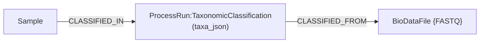

# NosoGraph

NosoGraph is a graph database schema designed for representing and integrating clinical, microbiological, and genomic data in a unified framework. Built on graph data modeling principles, it encodes entities, such as patients, specimens, microorganisms, genes, and variants as nodes, and their relationships as edges, enabling explicit and queryable connections across traditionally siloed datasets.

The schema is intended to support the construction of biomedical knowledge graphs, with a focus on infectious diseases and antimicrobial resistance (AMR). By structuring data around relationships rather than isolated records, NosoGraph enables intuitive exploration of complex questions—for example, linking patient context to microbial isolates, genomic variants, and resistance phenotypes within a single query.

This repository provides the core schema design, example data models, and practical resources for implementation using [Neo4j](https://neo4j.com/), including installation guidance, sample CSV files for data import, and example Cypher queries. NosoGraph is designed to be extensible and adaptable to different research and hospital settings, supporting use cases such as outbreak investigation, genomic epidemiology, and integrated clinical-genomic analysis.

## Knowledge Graph Design Overview

The graph is organized into three interoperable domains, each modeling a different layer of clinical–biological knowledge and linked through explicit relationships.

| 
|:--
| *Figure 1:* An illustration of entities relationship pattern for managing bacterial whole genome sequencing data and all relevant information by NosoGraph. A directed arrow indicates a one-way relationship between entities, while an undirected line indicates bi-directional relationships.

1) Clinical terminology
This layer represents standardized clinical concepts using SNOMED CT, including disorders, clinical findings, situations, and morphologic abnormalities.
SNOMED provide a controlled vocabulary for patient conditions, enabling consistent representation, disease grouping, and provide point of reference to external clinical data.

2) Patient and clinical metadata
This layer stores patient metadata and care processes, including patients' information, admissions, wards, specimens, and laboratory results e.g. MICs, CBC. It captures who the patient is, when and why they were admitted, what specimens were collected, and what tests were done, when, and what are the results forming the clinical context for downstream analyses.

3) Microbiology and genomics layer
This layer represents the biological entities and analyses derived from patient specimens, including isolates, organisms, genome assemblies, genes, features, and variants identified through sequencing pipelines.

## Usage

First, clone the repository:

```bash
git clone https://github.com/STTLab/NosoGraph.git
cd NosoGraph
```

### NosoGraph pipeline

The NosoGraph sequencing pipeline supports hybrid and long-read bacterial genome assembly (Flye, Canu), iterative polishing (Racon, Pilon), and quality assessment (CheckM2). It is implemented in [Nextflow](https://www.nextflow.io/) DSL2 and runs on local machines and HPC clusters (SLURM).

#### Requirements

- [Nextflow](https://www.nextflow.io/docs/latest/install.html) ≥ 23.04
- [Singularity / Apptainer](https://apptainer.org/) (default execution engine)
- [Conda](https://docs.conda.io/) or [Micromamba](https://mamba.readthedocs.io/en/latest/installation/micromamba-installation.html) — only if you opt into `-profile micromamba` instead of containers

Install Nextflow:

```bash
curl -s https://get.nextflow.io | bash
mv nextflow ~/bin/
```

**Execution engine.** By default the pipeline runs each process from a frozen container image (Singularity/Apptainer) — this is the reproducible path, and it is the default because unreliable Conda releases made env-solving non-reproducible. Images are pulled on first run; no manual setup is required. Every vendored module carries both a `container` and a `conda` directive, so you can still fall back to Conda with `-profile micromamba` when a container runtime is unavailable.

| `-profile` | Engine | When to use |
|---|---|---|
| _(none)_ / `standard` | Containers, local executor | Default |
| `slurm` | Containers, SLURM executor | HPC clusters |
| `micromamba` | Conda (via micromamba) | No container runtime available |
| `test` | Neither (stub only) | `-stub-run` DAG validation |

Container images live at `<container_registry>/bioinf-<tool>:<container_tag>` (default registry `ghcr.io/minaminii`, tag `latest`). Override the registry/tag with `--container_registry` / `--container_tag`, or pin `--container_tag` to an immutable digest for a locked release. Only the vendored assembly → polish → QC tooling from [bioinformatics-workflows](https://github.com/minaminii/bioinformatics-workflows) (under `modules/vendor/`) is containerised. The NosoGraph-owned CSV exporters (`report/*.py`) are plain pandas scripts that run on the host Python interpreter — install their dependency with `pip install -r requirements.txt` into the environment you launch Nextflow from.

---

#### Pipeline parameters

| Parameter | Description | Default |
|---|---|---|
| `--pipeline` | Pipeline to run: `bacterial-assembly`, `autocycler`, or `kraken2-classify` | `bacterial-assembly` |
| `--sample_id` | Sample identifier; scopes outputs to `<outdir>/<sample_id>/` and namespaces contig IDs | required |
| `--long_reads` | Long-read FASTQ (gzipped or uncompressed) | required |
| `--kraken2_db` | Kraken2 DB directory with `hash.k2d`/`opts.k2d`/`taxo.k2d` (required for `--pipeline kraken2-classify`) | — |
| `--kraken2_mem` | Memory request for Kraken2 (≈ DB size; raise for the full Standard DB) | `64 GB` |
| `--kraken2_z_min` | `taxa_json` z-score cutoff; taxa below fold into an `"Other"` bucket | `-1.0` |
| `--kraken2_min_taxa` | Keep all taxa (no bucketing) when fewer than this many | `3` |
| `--read1` | Paired-end short reads R1 (required for Pilon) | — |
| `--read2` | Paired-end short reads R2 (required for Pilon) | — |
| `--assembler` | Assembler: `canu` or `flye` | required |
| `--tech` | Sequencing technology: `nanopore`, `nanopore-hq`, or `pacbio` | required |
| `--genome_size` | Genome size (e.g. `5m`, `2.6g`) — required for Canu | — |
| `--outdir` | Output directory | `results` |
| `--threads` | Threads per process | `1` |
| `--racon_iter` | Racon polishing iterations | `1` |
| `--pilon_iter` | Pilon polishing iterations | `1` |
| `--checkm2_db` | Path to CheckM2 database (`uniref100.KO.1.dmnd`) | — |
| `--queue` | SLURM partition name (`-profile slurm` only) | — |

---

#### Running locally

Hybrid assembly with Flye:

```bash
nextflow run main.nf \
    --sample_id sample_01 \
    --long_reads reads.fastq.gz \
    --read1 sample_R1.fastq.gz \
    --read2 sample_R2.fastq.gz \
    --assembler flye \
    --tech nanopore \
    --outdir results \
    --threads 16 \
    --racon_iter 2 \
    --pilon_iter 2 \
    --checkm2_db /path/to/uniref100.KO.1.dmnd
```

This writes the assembly under `results/01_assembly/` and a knowledge-graph CSV bundle to
`results/sample_01/kg/` (`sample.csv`, `assembly.csv`, `biodata_files.csv`, `contigs.csv`) ready for
import into Neo4j (see [NosoGraph knowledge graph](#nosograph-knowledge-graph)).

Long-read-only assembly with Canu:

```bash
nextflow run main.nf \
    --sample_id sample_02 \
    --long_reads pacbio_reads.fastq.gz \
    --assembler canu \
    --tech pacbio \
    --genome_size 5m \
    --outdir results \
    --threads 32
```

---

#### Metagenomics (pathogen identification)

The `kraken2-classify` pipeline classifies long reads against a pre-built Kraken2 database and
turns the result into a high-level, pathogen-ID knowledge graph — in a **single** Nextflow
run. The vendored [`kraken2-classify`](modules/vendor/kraken2-classify/) module produces the
Kraken2 report, which is exported to the `kg/` CSVs.

```bash
nextflow run main.nf \
    --pipeline kraken2-classify \
    --sample_id sample_meta \
    --long_reads reads.fastq.gz \
    --kraken2_db /path/to/k2_standard \
    --outdir results
```

It reads the per-sample Kraken2 report (`kraken2/<sample_id>.kraken2.report.txt`, filtered to
species + genus) and writes a knowledge-graph CSV bundle to
`results/sample_meta/kg/` (`taxonomic_classification.csv`, `meta_reads.csv`). The input
FASTQ given to `--long_reads` is also recorded as a `BioDataFile` node. The resulting subgraph
(a public NosoGraph extension built on the generic `ProcessRun` pattern) is:



The identified taxa are **not** modelled as `Organism` nodes: Kraken2 output is an untrusted,
per-run classification (produced before the curated DB is built), and it isn't meant to be
traversed in the graph. Instead they ride along as a single JSON-string property `taxa_json`
on the `TaxonomicClassification` node — a read-set QC glance, sorted by abundance and
pre-filtered with an adaptive z-score bucket (taxa below `--kraken2_z_min` fold into an
`"Other"` row; filtering is skipped when there are fewer than `--kraken2_min_taxa` taxa).
Recover rows in Neo4j Browser with `apoc.convert.fromJsonList`.

Import these CSVs with **LOAD DATA** steps `17`–`18`, then run the **QUERIES → Pathogens detected per
sample** template (unpacks `taxa_json`; see [NosoGraph knowledge graph](#nosograph-knowledge-graph)).

---

#### Running on SLURM

Add `-profile slurm` to submit each process as an independent SLURM job. Specify your partition with `--queue`:

```bash
nextflow run main.nf \
    -profile slurm \
    --queue normal \
    --sample_id sample_01 \
    --long_reads reads.fastq.gz \
    --assembler flye \
    --tech nanopore \
    --outdir results \
    --threads 16 \
    --racon_iter 2 \
    --pilon_iter 1 \
    --checkm2_db /path/to/uniref100.KO.1.dmnd
```

Default resource allocations per process label (adjustable in `modules/vendor/bacterial-assembly/nextflow.config`):

| Process | CPUs | Memory | Time |
|---|---|---|---|
| Assembly (Flye) | `--threads` | 32 GB | 24 h |
| Assembly (Canu) | `--threads` | 32 GB | 24 h |
| Racon iteration | `--threads` | 32 GB | 24 h |
| Pilon iteration | `--threads` | 28 GB | 12 h |
| CheckM2 | `--threads` | 32 GB | 12 h |

To resume a run after a failure:

```bash
nextflow run main.nf -profile slurm -resume ...
```

---

#### Validating pipeline wiring (no data required)

Use `-stub-run` with `-profile test` to verify the full DAG compiles and all process connections are correct without needing real input files, containers, or conda environments:

```bash
nextflow run main.nf -stub-run -profile test \
    --sample_id sample_01 \
    --assembler canu \
    --tech pacbio \
    --genome_size 5m \
    --long_reads dummy.fastq.gz \
    --read1 dummy_R1.fastq.gz \
    --read2 dummy_R2.fastq.gz \
    --racon_iter 2 \
    --pilon_iter 2 \
    --checkm2_db dummy.dmnd \
    --outdir /tmp/nf_test
```

Expected output:

```
[PROCESS] BACTERIAL_ASSEMBLY:ASSEMBLY_CANU (1)
[PROCESS] BACTERIAL_ASSEMBLY:RACON_POLISH (1)
[PROCESS] BACTERIAL_ASSEMBLY:PILON_POLISH (1)
[PROCESS] BACTERIAL_ASSEMBLY:CHECKM2 (1)
[PROCESS] KG_EXPORT (sample_01)

[SUCCESS] completed=5 failed=0 cached=0
```

The `-profile test` flag disables both the container and conda engines so the stub runs locally without any tools installed. Input file paths are not checked for existence in stub mode — any placeholder string works.

### NosoGraph knowledge graph

This repository provides:

- A conceptual schema defining node labels, relationship types, and data domains
- Example CSV files for data import ([`example/csv/`](./example/csv))
- A single importable loader artefact — [`assets/nosograph_cypher_templates.csv`](./assets/nosograph_cypher_templates.csv) — a Neo4j Browser saved-queries file with the constraints, idempotent `LOAD CSV` import queries, and example analytical queries
- Per-sample knowledge-graph exporters that the pipelines run to write `kg/` CSVs to `<outdir>/<sample_id>/kg/` — `report/kg_export.py` (bacterial assembly) and `report/meta_kg_export.py` (metagenomics pathogen ID)
- Guidance for setting up Neo4j as a working environment

Users can adopt the schema as a starting point, extend it to fit their specific use cases, and integrate it with custom pipelines or applications as needed.

We recommend checking out the example directory to get started.

It is important to note that, **NosoGraph is not a database management system (DBMS)** and does not provide a complete software platform for data ingestion, storage, or analysis. Instead, it defines a blueprint outlining structured conceptual model that guides how clinical, microbiological, and genomic data should be organized and linked within a graph database. The implementation of the underlying infrastructure (e.g., data pipelines, deployment environment, access control, and application interfaces) is intentionally out of scope of this repository. Users are expected to adapt the schema to their own systems and integrate it with existing workflows or tools.

We recommend using Neo4j as the platform offers an intuitive desktop interface, providing ease-of-use for general users and a mature ecosystem for graph-based development.

> [info]
> **Disclaimer:** This project is not affiliated with, endorsed by, or sponsored by Neo4j, Inc. “Neo4j” and related trademarks are the property of Neo4j, Inc. All references to Neo4j within this repository are for informational and implementation purposes only.

### Quick Start (Neo4j Desktop)

#### 1. Install Neo4j Desktop

Download and install Neo4j Desktop from:

[https://neo4j.com/download/](https://neo4j.com/download/)

Follow instructions to download, install, and launch the application.

#### 2. Create a New Database

1. Choose "Local instances" on the sidebar menu
2. Click "Create instance"
3. Fill instance details according to instructions.
4. Set a database name (e.g., nosograph-db)
5. Set a password and store it securely
6. Click “Create”.
7. Connect to the instance through "Query" or "Explore" menu

#### 3. Prepare Data Import

CSV files are loaded from the instance's **import directory**, found in the instances list on the
connection screen, e.g. `Path: C:\Users\<username>\.Neo4jDesktop2\Data\dbmss\dbms-<instance-id>\import`.

Copy both sources into that import directory:

1. The hand-authored clinical CSVs from [`example/csv/`](./example/csv) (`Departments.csv`, `Wards.csv`,
   `Patients.csv`, `Admissions.csv`, `Antibiotic.csv`, `Specimens.csv`, `Samples.csv`, `Organisms.csv`,
   `ReferenceGenomes.csv`, `LabResults.csv`, `SNPs.csv`) — copy them to the import-directory **root**.
2. For each sequenced sample, the pipeline-produced `kg/` directory from
   `<outdir>/<sample_id>/kg/` — copy it so it sits at `<import>/<sample_id>/kg/`.

#### 4. Load with the bundled Cypher templates

This repository ships no programmatic loader — the only loader artefact is the saved-queries file
[`assets/nosograph_cypher_templates.csv`](./assets/nosograph_cypher_templates.csv).

1. In Neo4j Browser, open the **Favorites** sidebar → **Import Cypher queries** and select
   `assets/nosograph_cypher_templates.csv`. The queries appear under a **NosoGraph** folder
   (`SETUP` / `LOAD DATA` / `QUERIES` / `UTILITIES`).
2. Run **SETUP → Create Constraints** once.
3. Run the **LOAD DATA** queries in order. For the per-sample genomic loads (`10`–`15`,
   and `17`–`19` for metagenomics samples), replace `<sample_id>` in the
   `file:///<sample_id>/kg/...` paths with your actual sample id.
4. Each load is idempotent (`MERGE`, `IN TRANSACTIONS OF 500 ROWS`), so re-running is safe.

The node labels, properties, and relationships these templates create match the canonical NosoGraph
graph schema, so a manual load yields the same structure as the interface library's ingest.

#### 5. Explore the Graph

From the **QUERIES** folder (or the Query editor) you can:

- Run the example analytical queries (node counts, the Patient→Specimen→Sample→Assembly→Contig spine,
  AMR susceptibility summary, shared-contig clonality clusters, variants per gene)
- Visualize relationships interactively and expand nodes (double-click)

## Acknowledgement

This work was supported by the following funding bodies:

- The Fundamental Fund 2025, Chiang Mai University, Chaing Mai, Thailand (Grant number: 214458).
- The Faculty of Medicine Research Fund, Chiang Mai University (Grant No. 099-2563)
- Support the Children Foundation, Chiang Mai, Thailand.

---

## Citation

Wattanasombat S, Tongjai S. NosoGraph: assembly pipeline and Neo4j knowledge graph for integrating clinical, microbial, and genomic data [computer software]. GitHub; 2026. Available from: https://github.com/STTLab/NosoGraph


## STTLab Members

- Sara Wattanasobat
- Siripong Tongjai (PI)

Department of Microbiology, Faculty of Medicine, Chiang Mai University, Chiang Mai, 50200 Thailand
